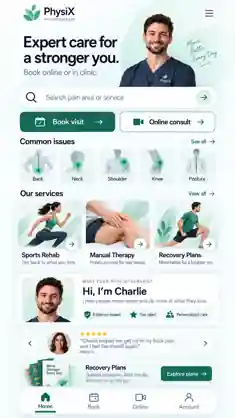

# PhysiX visual handoff — restore the owner's selected design

## Owner correction, 2026-09-08

**The owner rejected the public-v2 redesign. The original mint/white, navy-text, mobile-app-style homepage is the visual reference again.** The request was to extend that design to the other public screens, not replace its appearance or rewrite its buttons.

The owner reattached the original homepage in the latest correction. The existing compact repository copy below depicts that same direction; it is not a full-resolution asset.

The reattached PNG is 941 × 1672, SHA-256 `5ea90e35bad55ce33a202bda363465e123334a7f751a50aa883f7abd7720b3c2`. This identifies the owner's reference, not a newly committed original. The chat attachment is the detailed source when available. Do not upscale the compact thumbnail or treat it as production artwork.

**Do not implement the public-v2 screenshots, CSS, rewritten copy or editorial layout.** Its [archive](public-v2/README.md) remains in Git for traceability. Its screen/state inventory may help identify functional coverage, but its visual treatment was rejected. Old workflow success and screen counts do not amount to design approval.

## Preserve the appearance

Keep the PhysiX leaf mark and wordmark composition, cool pale mint/white background, dark navy typography, deep-teal actions, soft rounded surfaces and floating white four-item dock. Preserve the custom service imagery, anatomical issue illustrations with mint highlights, portrait-led hero, image-led service cards and compact Charlie profile card without separator columns. Do not substitute generic icons, warm beige editorial styling, a bare replacement wordmark, flat list rows, or an unrelated desktop-marketing composition.

Keep the homepage sequence: header and short hero; prominent centered finder; Book visit / Online consult; Common issues; Our services; Charlie; the locally revised testimonial treatment; the lower Recovery Plans teaser; dock. The page scrolls. It is not a single phone-height poster.

The request to improve the testimonial container did NOT approve redesigning Charlie's card or introducing the public-v2 dark full-width story band. Retain Charlie's compact card. Change only the testimonial treatment when producing the next homepage revision; preserve everything else. No replacement testimonial design has been approved yet.

## Exact English reference copy

Preserve these strings in the visual reference. Do not silently rewrite capitalization, names or wording while extending the screens. Accessibility labels can add context without replacing visible text. Bulgarian translation is a separate reviewed content task.

| Element | Reference text |
|---|---|
| Brand | PhysiX / PHYSIOTHERAPY |
| Hero heading | Expert care for a stronger you. |
| Hero supporting line | Book online or in clinic. |
| Finder placeholder | Search pain area or service |
| Primary action | Book visit |
| Secondary action | Online consult |
| Issue section and link | Common issues / See all |
| Issue items | Back / Neck / Shoulder / Knee / Posture |
| Service section and link | Our services / View all |
| Service titles | Sports Rehab / Manual Therapy / Recovery Plans |
| Sports Rehab supporting text | Get back to what you love. |
| Manual Therapy supporting text | Hands-on care for real results. |
| Recovery Plans card supporting text | Move better for a brighter you. |
| Practitioner eyebrow | MEET YOUR PHYSIOTHERAPIST |
| Practitioner heading | Hi, I’m Charlie |
| Practitioner supporting text | I help people move better and do more of what they love. |
| Programme action | Explore plans |
| Dock, in order | Home / Book / Online / Account |

These are design-reference strings, not verification of professional qualifications, treatments, product availability or reviews. Generated faces and the mockup's star rating, testimonial and Top rated badge are not factual clinic content. Keep reference and production approval separate rather than inventing proof or using content review as a reason to restyle the whole page.

## Extend, do not redesign

Create the other public screens using this same component family: header, finder, buttons, cards, fields, imagery, typography, dock and spacing. A Services page is the same PhysiX interface with service-discovery content, not a new visual direction. A booking page uses matching controls and a focused action area, not a generic scheduling template. Earlier generated services/booking/online concepts can inform composition, but the latest selected home controls the brand and shared labels.

Public scope: Home; Services and service details; Charlie; Clinic/contact; Online; FAQ; menu/search; visitor booking steps and error/empty/loading/success states; public sign-in entry; legal pages. Programme/purchase layouts remain future-gated. No Gymaf, signed-in dashboard, player or staff design in this task.

## Responsive fidelity

Use actual HTML text and reusable components for implementation. Preserve the visual family when adapting to smaller widths. Prefer natural wrapping and readable horizontal rails over tiny type; do not shrink a 941px composition wholesale into 390px. Aim for the selected two-line headline where it fits; do not clip translated or enlarged text. Wider desktop layouts must be an extension of the same brand, not a separate redesign.

The dock has four equal labelled destinations and no raised center button. Search text is left-aligned inside its centered container. Keep the primary filled / secondary outlined action hierarchy. No simulated iPhone status bar, unnecessary dividers, or new navigation labels. Focused booking may replace the dock with its step action; it must not change the site's visual language.

## Actual completion state

The homepage direction is selected. Its testimonial correction and the complete matching public screen set are **unfinished**, not owner-approved deliverables. Reopen and track that work in [the existing backlog](../tasks.md). Do not call 41 rejected prototype states a finished visual design or present browser renders as image-generation outputs.

[Design system](../design-system.md) owns implementation behavior. [Local handoff](../handoff.md) owns the execution prompt. [Asset manifest](asset-manifest.md) and [asset prompts](asset-prompts.md) retain provenance/production requirements, but any conflicting older style instructions are superseded by this owner correction.
